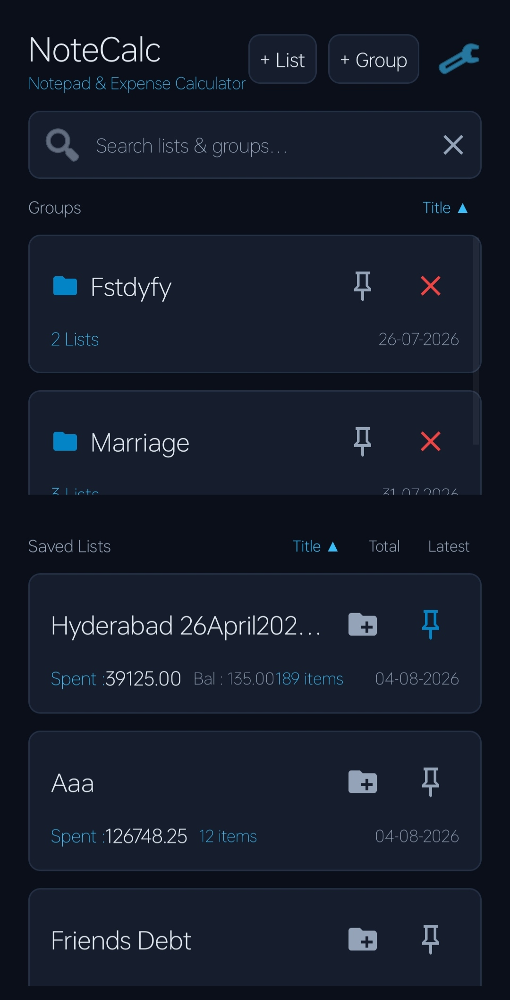
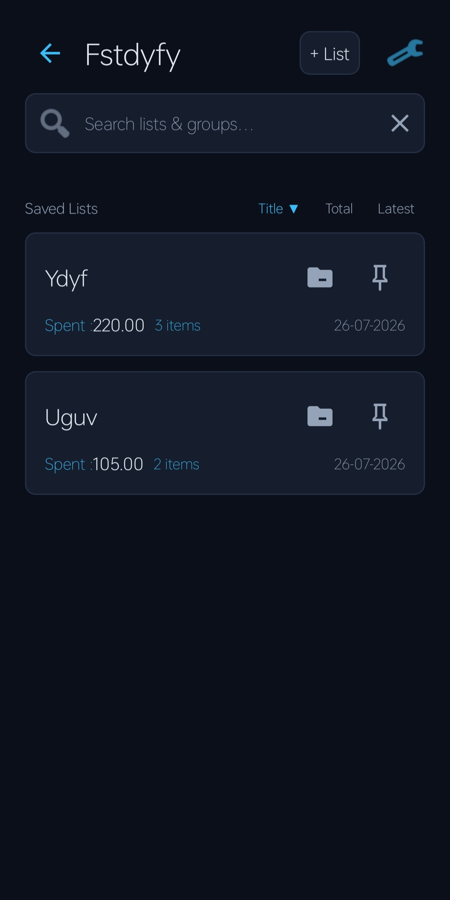
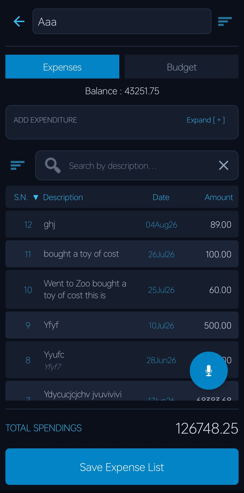
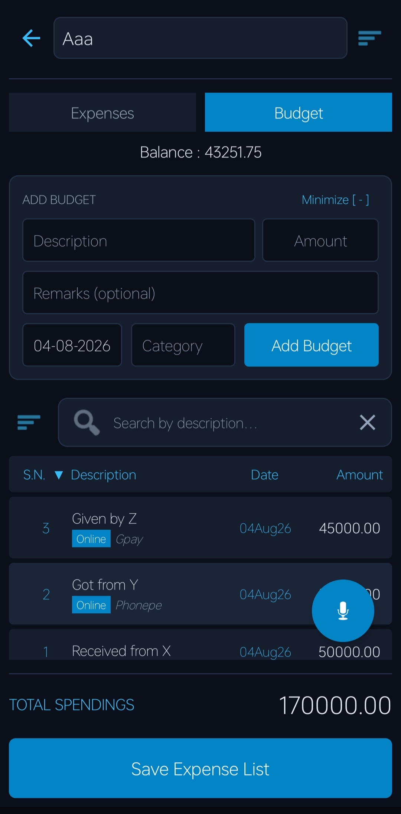
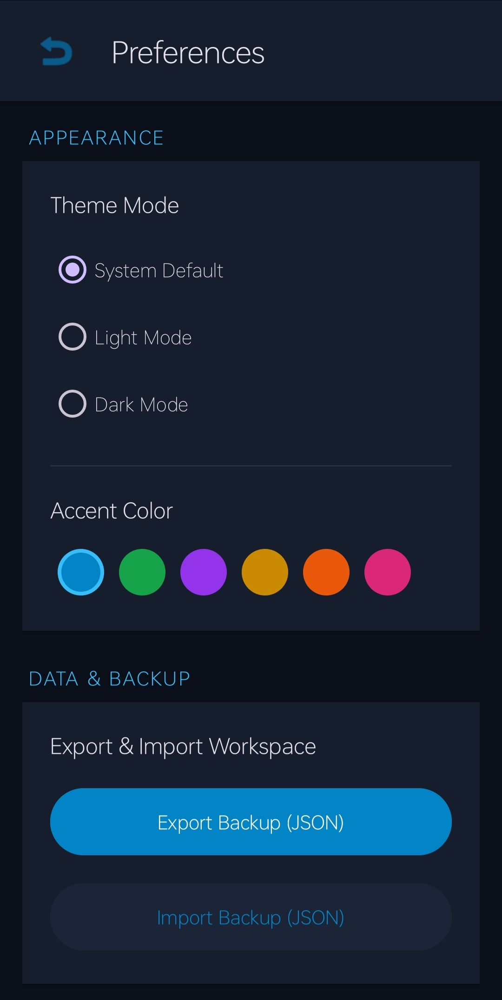
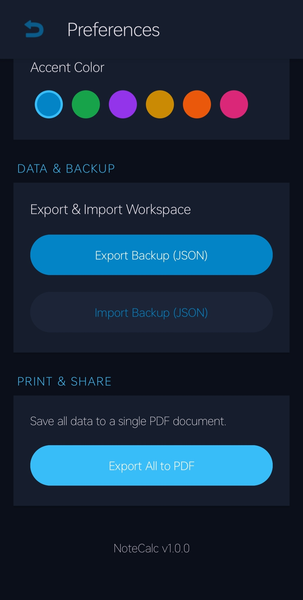

# NoteCalc 📓🧮


**NoteCalc** is a premium, offline-first Android expense tracker and calculator designed to bridge the gap between simple note-taking and structured financial tracking. It combines a stunning, modern interface with powerful tools like dual tracking modes, detailed PDF exports, and an organized dashboard for an intuitive accounting experience.

---

## 📌 App Information

- **Current Version:** v1.2.0
- **Minimum SDK:** Android 7.0 (Nougat)
- **Language:** Java
- **Last Updated:** August 2026

---

## 📥 Download APK

🔽 **Latest Version**  
[Download NoteCalc (Latest)](https://github.com/sameer021000/NoteCalc/releases/latest)

📜 **All Versions**  
[View All Releases](https://github.com/sameer021000/NoteCalc/releases)

> ⚠️ Enable "Install from Unknown Sources" in Android settings before installing the APK.

---

## ✨ Key Features

### 🚀 **Advanced Financial Tracking**
*   **Dual Modes (Expenses & Budgets)**: Track both your outgoing expenses and incoming budgets seamlessly. The app automatically calculates totals and dynamically displays balances.
*   **Custom Groups & Accounts**: Organize your financial data effortlessly. Create standalone accounts (e.g., "Trip to Paris", "Monthly Groceries") or group related accounts together under custom folders.
*   **Smart Dashboard**: A beautifully designed management screen featuring dynamic search, quick sorting (Latest, Title, Total Amount), and interactive empty states.
*   **Advanced Filtering**: Search through records by description or remarks, and filter by exact date or amount ranges.
*   **Bulk Actions & Transfers**: Seamlessly cut or copy selected records between lists, or quickly spin up a new list from your selection.
*   **Isolated Category Tracking**: Category dropdowns are strictly isolated to your current list, keeping your autocomplete clean and relevant.
*   **PDF Sort Dialog**: Intuitively sort your PDF statements by Serial Number, Description, Date, or Amount prior to generation.

### 🎯 **Reporting & Backup**
*   **PDF Export Engine**: Generate beautiful, multi-table, paginated PDF reports of your accounts directly on your device. Support for exporting individual accounts, all data at once, or generating clean, budget-free statements for a specific selection of records.
*   **Privacy-First & Offline**: No cloud syncing forced upon you. All data is securely stored locally on your device via SharedPreferences using an optimized JSON serialization structure.
*   **JSON Import / Export**: Easily backup your entire workspace to a JSON file and restore it whenever you switch devices or need to recover data.

### 🎨 **Premium UI/UX**
*   **Modern Aesthetics**: Features glassmorphism, rounded layouts, smooth animations, and clean Material Design. Edge-to-edge window insets provide an immersive visual experience.
*   **Dynamic Interactions**: Fluid `StateListDrawables` for instant tactile feedback on touch interactions.
*   **Intuitive Editor**: Add records quickly using a refined form, supporting custom dates, optional remarks, and auto-sorting based on your preferences.

---

## 📱 Screenshots

|                          Dashboard                           |                      Group Dashboard                       |
|:------------------------------------------------------------:|:----------------------------------------------------------:|
|                |  |
|                       **Expenses Mode**                      |                       **Budget Mode**                      |
|             |               |
|                       **Settings 1**                         |                       **Settings 2**                       |
|               |             |
---

## 🛠️ Tech Stack

*   **Language**: Java
*   **UI**: Native Android XML Layouts, Custom Programmatic Drawables, Material Components
*   **Persistence**: SharedPreferences with custom JSON (`org.json.JSONObject`) serialization
*   **PDF Generation**: Native `android.graphics.pdf.PdfDocument`
*   **Compatibility**: Android 7.0 (Nougat) and above

---

## 📥 Installation

1.  **Clone the repository:**
    ```bash
    git clone https://github.com/sameer021000/NoteCalc.git
    ```
2.  **Open in Android Studio**:
    *   File > Open > Select the cloned directory.
3.  **Build & Run**:
    *   Sync Gradle files.
    *   Run on an emulator or physical Android device.
